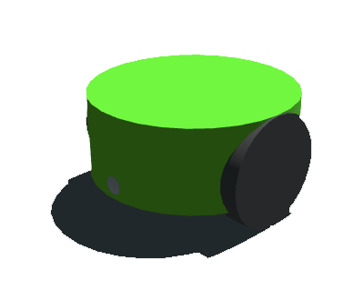

<!-- E-puck image at the very top -->

  

# Evolutionary e-puck Simulator (PyBullet + Genetic Algorithm)

## Overview

This is a PyBullet-based evolutionary robotics simulator for the e-puck mobile robot with optional gripper attachment. The system supports:

- Evolution System - Genetic algorithms to evolve robot controllers
- Braitenberg Controllers - Reactive navigation based on sensor-motor connections
- Bitmask Controllers - Discrete action lookup tables (evolved)
- Dual Viewer Scripts - CLI for power users, GUI for beginners
- Gripper Manipulation - Manual control (autonomous grasping: future work)
- Fitness Evaluation - Multiple metrics (Nolfi, coverage-based)

---

## Project Structure

epuck-simulator/
├── view_epuck_sim.py          # CLI viewer (advanced users, quick testing)
├── viewer_epuck_sim.py        # GUI viewer (beginners, demos)
├── run_epuck_evol.py          # Evolution runner (genetic algorithm)
├── plot_fitness.py            # Fitness plotter (parse logs, visualize)
├── config_loader.py           # Configuration parser
├── world_builder.py           # World generator from config
├── epuck_config.json          # Main configuration file
├── braitenberg_avoidance.json # Example Braitenberg controller
├── robots/
│   ├── epuck_sim.urdf         # Robot model (navigation only)
│   └── epuck_gripper.urdf     # Robot model (with gripper)
└── best_chromosomes/          # Evolution output (auto-created)
    ├── evolution_config.json              # Saved config snapshot
    ├── evolution_20260213_143052.log      # Fitness log (timestamped)
    ├── gen_0000.json                      # Best controller generation 0
    ├── gen_0050.json                      # Best controller generation 50
    └── gen_0099.json                      # Best controller generation 99

---

## Quick Command Reference

### Main Commands

Task                              Command
Run evolution                     python run_epuck_evol.py
Run evolution (custom config)     python run_epuck_evol.py --config my_config.json
Plot evolution results            python plot_fitness.py best_chromosomes/evolution_*.log
Plot with custom title            python plot_fitness.py evolution.log --title "My Experiment"
Save plot to file                 python plot_fitness.py evolution.log --save fitness.png
Test controller (CLI)             python view_epuck_sim.py controller.json 5000
Test controller (GUI)             python viewer_epuck_sim.py
Monitor evolution live            tail -f best_chromosomes/evolution_*.log

### Keyboard Controls (During Simulation)

Key       Action
SPACE     Toggle fast/real-time mode
P         Pause/resume simulation
R         Reset robot to initial position
H         Open gripper (if gripper detected)
J         Close gripper (if gripper detected)
G         Toggle fullscreen (PyBullet built-in)
Ctrl+C    Stop evolution gracefully (saves progress)

---

## Quick Start

### Running Evolution

# Run with default configuration
python run_epuck_evol.py

Output:
============================================================
=== ePuck Evolution Starting ===
============================================================
Config: epuck_config.json (default)
Population: 24
Generations: 100
...

[LOG] Logging to: best_chromosomes/evolution_20260213_143052.log

Gen    0 | best: 248.334 | avg: -180.908 | rule: ['reverse', 'reverse', ...]
Gen    1 | best: 260.579 | avg: -70.411 | rule: ['reverse', 'reverse', ...]
Gen    2 | best: 257.691 | avg: -131.290 | rule: ['reverse', 'right', ...]
...

Features:
- Auto-saves log with timestamp (never overwrites)
- Saves best controller every generation
- Press Ctrl+C anytime to stop gracefully
- No matplotlib crashes (plotting is separate)

---

### Plotting Results

# Plot fitness curves
python plot_fitness.py best_chromosomes/evolution_20260213_143052.log

Features:
- Line plot: Best fitness and average fitness over generations
- Statistics box: Final best, final avg, max fitness achieved
- Save option: --save output.png
- Custom title: --title "Experiment Name"

---

### Testing Controllers

#### Command-Line (Advanced Users)

python view_epuck_sim.py best_chromosomes/gen_0099.json 5000

Arguments:
- controller.json - Controller file (required)
- 5000 - Number of simulation steps (optional, default: 10000)

Features:
- Verbose console output
- Keyboard controls (SPACE, P, R, H, J)
- Fitness results printed at end

---

#### GUI Launcher (Beginners)

python viewer_epuck_sim.py

Features:
- File browser to select controller
- Input field for number of steps
- GUI/DIRECT mode toggle
- Results popup at end
- Same keyboard controls during simulation

---

## Important: Script Name Changes (v1.5.0)

The viewer scripts were renamed for clarity:

Old Name (v1.0)       New Name (v1.5.0)        Purpose
view_epuck_sim.py     view_epuck_sim.py        CLI viewer for advanced users
run_epuck_sim.py      viewer_epuck_sim.py      GUI viewer for beginners
(new)                 run_epuck_evol.py        Evolution runner

Why the change?
- Original names were confusing (backwards)
- view_epuck_sim.py = command-line viewing tool
- viewer_epuck_sim.py = GUI viewer launcher
- run_epuck_evol.py = runs evolution experiments

If you have old code referencing run_epuck_sim.py:

# Old way
python run_epuck_sim.py

# New way
python viewer_epuck_sim.py

---

## Evolution System

### How It Works

The genetic algorithm evolves bitmask controllers - lookup tables mapping sensor states to actions:

1. Initialize random population of controllers
2. Evaluate each controller in simulation (fitness = navigation quality)
3. Select best controllers (elitism + fitness-proportional)
4. Reproduce via crossover and mutation
5. Repeat for N generations

Encoding: 8-rule lookup table for 3-bit sensor states (left/center/right obstacles)

Fitness Function: Coverage-based metric rewarding:
- Distance traveled
- Area explored (unique cells visited)
- Wheel activity (avoiding stuck states)
- Early movement (leaving start area quickly)

### Configuration

All parameters in epuck_config.json:

"evolution": {
  "population_size": 24,        // Number of individuals
  "generations": 100,           // Evolution iterations
  "mutation_rate": 0.15,        // Gene change probability
  "crossover_rate": 0.7,        // Parent mixing probability
  "elitism": 2,                 // Top N kept unchanged
  "eval_repeats": 3,            // Tests per controller
  "eval_steps": 2000,           // Steps per test
  "random_seed": null           // Set for reproducibility
}

### Output Files

Generated in best_chromosomes/ directory:

File                             Description
evolution_config.json            Snapshot of config used (reproducibility)
evolution_YYYYMMDD_HHMMSS.log    Fitness log with timestamp (never overwrites)
gen_0000.json                    Best controller from generation 0
gen_0050.json                    Best controller from generation 50
gen_0099.json                    Best controller from generation 99 (final)

Log format:
Gen    0 | best: 248.334 | avg: -180.908 | rule: ['reverse', 'reverse', ...]
Gen    1 | best: 260.579 | avg: -70.411 | rule: ['reverse', 'reverse', ...]

---

## Controller Configuration

### Braitenberg Controller Example

{
  "encoding": "braitenberg",
  "left_weights":  [-2.0, -1.5, -1.0, -0.5, 0.5, 1.0, 1.5, 2.0],
  "right_weights": [2.0, 1.5, 1.0, 0.5, -0.5, -1.0, -1.5, -2.0],
  "left_bias":   0.0,
  "right_bias":  0.0,
  "max_speed":   0.35
}

Parameters:
- left_weights: 8 weights connecting sensors to left wheel
- right_weights: 8 weights connecting sensors to right wheel
- left_bias: Constant forward drive (left wheel)
- right_bias: Constant forward drive (right wheel)
- max_speed: Maximum wheel speed (0.0-1.0)

Sensor mapping:
Sensor indices (0-7) arranged around robot:
     2   3   4   5
   1               6
 0                   7
      [ROBOT]

How it works:
left_wheel_speed = sum(sensor[i] * left_weight[i]) + left_bias
right_wheel_speed = sum(sensor[i] * right_weight[i]) + right_bias

Example behavior (obstacle avoidance):
- Front sensors detect wall → opposite wheel speeds → turn away
- Left sensors strong negative → right wheel speeds up → turn right
- Right sensors strong positive → left wheel speeds up → turn left

---

### Bitmask Controller Example

{
  "encoding": "bitmask",
  "chromosome": ["forward", "right", "left", "reverse", 
                 "right", "right", "left", "left"],
  "generation": 99,
  "fitness": 456.78
}

Sensor encoding (3-bit state):
- Bit 2 (MSB): Left sensors (0, 1) detect obstacle
- Bit 1: Center sensors (2, 3, 4, 5) detect obstacle
- Bit 0 (LSB): Right sensors (6, 7) detect obstacle

State lookup:

Binary  Decimal  Left      Center    Right     Action
000     0        Clear     Clear     Clear     chromosome[0] (usually "forward")
001     1        Clear     Clear     Obstacle  chromosome[1] (e.g., "left")
010     2        Clear     Obstacle  Clear     chromosome[2] (e.g., "reverse")
011     3        Clear     Obstacle  Obstacle  chromosome[3] (e.g., "left")
100     4        Obstacle  Clear     Clear     chromosome[4] (e.g., "right")
101     5        Obstacle  Clear     Obstacle  chromosome[5] (e.g., "reverse")
110     6        Obstacle  Obstacle  Clear     chromosome[6] (e.g., "right")
111     7        Obstacle  Obstacle  Obstacle  chromosome[7] (e.g., "reverse")

Available actions:
- forward: Both wheels full speed forward
- left: Left wheel slow, right wheel fast (turn left)
- right: Right wheel slow, left wheel fast (turn right)
- reverse: Both wheels backward
- stop: Both wheels stop
- wander: Asymmetric speeds for exploration

Example: If left and center sensors detect obstacles → state = 0b110 = 6 → action = chromosome[6] (e.g., "right")

---

## Configuration System

All simulation parameters are centralized in epuck_config.json:

### Key Sections

Robot Physics:
"robot": {
  "urdf_path": "robots/epuck_sim.urdf",
  "wheel_radius": 0.0205,
  "max_speed": 0.35,
  "max_motor_torque": 0.5,
  "friction": {
    "wheel": 2.0,      // High traction
    "chassis": 0.3,    // Low drag
    "caster": 0.1      // Smooth rolling
  },
  "spawn_margin": 0.2  // Distance from walls at start
}

Sensor Configuration:
"sensors": {
  "num_sensors": 8,
  "range": 0.055,             // 5.5cm detection range
  "obstacle_threshold": 0.25  // 25% reading = obstacle detected
}

World Setup:
"world": {
  "type": "basic_walls",      // basic_walls, obstacles, maze
  "size": 1.5,                // Arena dimensions (1.5m x 1.5m)
  "gravity": -9.81,
  "timestep": 0.01,
  "plane_urdf": "plane.urdf"
}

Fitness Functions:
"fitness": {
  "nolfi": {
    "max_speed": 0.35
  },
  "coverage": {
    "distance_weight": 100.0,
    "wheel_weight": 0.1,
    "coverage_weight": 2.0,
    "min_movement_threshold": 0.05
  }
}

Evolution Parameters:
"evolution": {
  "population_size": 24,
  "generations": 100,
  "mutation_rate": 0.15,
  "crossover_rate": 0.7,
  "elitism": 2,
  "eval_repeats": 3,
  "eval_steps": 2000
}

### Using Custom Configs

# Create custom config
cp epuck_config.json my_experiment.json

# Edit parameters
nano my_experiment.json

# Run with custom config
python run_epuck_evol.py --config my_experiment.json
python view_epuck_sim.py controller.json 5000 --config my_experiment.json

---

## Design Philosophy: Evolution-First Approach

### Why Simple Controllers Get Stuck

Pure reactive controllers (like Braitenberg) can get trapped in corners when:
- Sensors detect obstacles symmetrically on both sides
- Controller outputs equal wheel speeds → robot pushes into corner
- No memory or planning → can't learn from being stuck

This is INTENTIONAL and GOOD for evolutionary robotics!

### Evolution's Job

The genetic algorithm should discover solutions to corner-trapping:

- Asymmetric sensor weights - Break left/right symmetry
- Appropriate bias values - Maintain momentum to avoid stalling
- Action sequences - Escape behaviors (reverse → turn)
- Emergent strategies - Wall-following, zigzag patterns, exploration

Poor controllers get stuck → Low fitness → Removed from population
Good controllers escape → High fitness → Reproduce and survive

This selective pressure drives evolution toward robust, adaptive navigation.

### Unstuck Behavior (Optional Testing Aid)

An automatic escape maneuver is available for manual testing and demos:

How it works:
- Triggers after robot stuck for 200 frames (not moving)
- Reverses 30 frames, turns 180° (80 frames), resumes normal control
- Random turn direction to break symmetry

When to use:
ENABLE_UNSTUCK = True   # Manual testing, demos, exploration
ENABLE_UNSTUCK = False  # Evolution experiments (recommended)

Why disable for evolution?
- Evolution should solve the corner-trapping problem itself
- Unstuck behavior masks fitness differences between controllers
- Best evolved controllers naturally avoid getting stuck
- Autonomous systems shouldn't rely on external rescue behaviors

Configuration:
# In view_epuck_sim.py or epuck_config.json
ENABLE_UNSTUCK = False      # Disable for evolution
STUCK_THRESHOLD = 200       # Frames before triggering
UNSTUCK_REVERSE_FRAMES = 30 # Backup duration
UNSTUCK_TURN_FRAMES = 80    # Turn duration

---

## Simulation Parameters

### Configurable Constants

Sensor Configuration:
NUM_SENSORS = 8           # Number of proximity sensors
SENSOR_RANGE = 0.055      # Detection range (5.5cm)
OBSTACLE_THRESHOLD = 0.25 # Minimum reading to count as obstacle

Arena:
WORLD_SIZE = 1.5          # Arena dimensions (1.5m x 1.5m)

Debug Output:
VERBOSITY = 1             # 0=silent, 1=normal, 2=verbose
DEBUG_PRINT_FREQ = 50     # Console output frequency (frames)

---

## Features

### 1. Evolution System

Genetic Algorithm:
- Population-based search
- Elitism (keep top performers)
- Crossover (mix parent controllers)
- Mutation (random changes)
- Fitness-based selection

Output:
- Timestamped logs (never overwrite)
- Best controller per generation saved
- Graceful Ctrl+C handling (saves progress)
- Config snapshot for reproducibility

### 2. Dual Viewer Scripts

view_epuck_sim.py (Command-Line):
- Quick testing
- Power users
- Script-friendly
- Verbose output

viewer_epuck_sim.py (GUI):
- Beginner-friendly
- File browser
- Visual feedback
- Results popup

Both support same keyboard controls!

### 3. Gripper Auto-Detection

Automatically detects URDF type:

[INFO] Loaded URDF: robots/epuck_sim.urdf
[INFO] No gripper detected - navigation only mode

or

[INFO] Loaded URDF: robots/epuck_gripper.urdf
[INFO] Gripper detected: left=6, right=7

Keyboard controls adapt:
- H/J keys shown only if gripper present
- Manual gripper control works in both viewers
- Autonomous grasping: future work

### 4. Fitness Evaluation

Nolfi-style fitness function:

V = average_wheel_speed      # Velocity (encourages movement)
D = differential_speed       # Turn penalty (encourages straight movement)
I = max_sensor_reading       # Obstacle proximity (encourages avoidance)

fitness = V * (1 - sqrt(D)) * (1 - I)

Coverage-based fitness function:

fitness = distance_traveled * 100
        + wheel_activity * 0.1
        + unique_cells_visited * 2.0
        + early_movement_bonus
        - stuck_penalty
        - oscillation_penalty

Printed at end:
=== RESULTS ===
Average fitness: 0.4523
Mean V (velocity): 0.652
Mean D (turn deviation): 0.234
Mean I (obstacle proximity): 0.123
================

Interpretation:
- High V (0.6-0.8) = Robot moving fast
- Low D (0.1-0.3) = Robot moving straight
- Low I (0.1-0.2) = Robot avoiding obstacles
- Good controllers: V ≈ 0.6-0.8, D ≈ 0.1-0.3, I ≈ 0.1-0.2

### 5. Debug Output

Console output during simulation (configurable frequency):

[t=  350] Sensors: [0.00, 0.00, 0.85, 0.92, 0.78, 0.00, 0.00, 0.00] | L/R: -0.12/+0.25 | Pos: (+0.34, -0.12)

Reading:
- t=350: Current timestep
- Sensors: 8 proximity readings [0.0-1.0]
- L/R: Left/right wheel speeds [-1.0, +1.0]
- Pos: Robot (x, y) position in arena

---

## Known Issues & Limitations

### 1. False Stuck Detection in Open Space

Issue: Robot can trigger stuck detection when moving slowly with no obstacles nearby.

Symptoms:
[WARNING] Robot appears STUCK! (counter=200, moved=0.004m in 50 frames)
Sensors: [0.00, 0.00, 0.00, 0.00, 0.00, 0.00, 0.00, 0.00]

Root Causes:
- Low bias values (< 0.15) → robot barely overcomes friction
- Stuck detection doesn't distinguish between "pushing against wall" and "moving slowly in open space"
- PyBullet friction creates realistic "stiction" below certain speeds

Workarounds:
1. Increase bias in controller: "left_bias": 0.2, "right_bias": 0.2
2. Increase stuck threshold: STUCK_THRESHOLD = 300
3. Disable unstuck for evolution: ENABLE_UNSTUCK = False

Proper fix (TODO):
# Only trigger if obstacle present OR wheels spinning hard
if dist_moved < 0.05 and (max(sensors) > 0.3 or abs(wheel_speed) > 0.2):
    stuck_counter += 1

Status: KNOWN ISSUE - Workarounds available, proper fix planned for v1.6.0

### 2. Corner Traps (Mitigated by Evolution)

Issue: Symmetric sensor readings in corners can trap reactive controllers.

Status: BY DESIGN - Evolution should discover escape strategies.

Solutions:
- Unstuck behavior (for testing/demos)
- Evolved asymmetric controllers (production)

### 3. Sensor Dead Zones

Issue: With 8 sensors, gaps between sensor cones can miss small obstacles.

Impact: Low (walls are large, gaps are small)

Future: 16 sensors or wider cones

### 4. Gripper Not Yet Autonomous

Status: Manual control (H/J keys) works, but no autonomous grasping.

Next steps:
1. Dual sensor system (navigation 5.5cm, gripper 1cm)
2. Object detection logic
3. Grasp force feedback
4. Evolve gripper controllers

---

## Future Work

### Phase 1: Navigation Evolution (v1.5.x) - CURRENT
- Genetic algorithm implementation ✓
- Bitmask controller encoding ✓
- Coverage-based fitness ✓
- Timestamped logging ✓
- Plotting tools ✓
- Improve stuck detection logic (in progress)

### Phase 2: Gripper System (v2.0.0) - NEXT
- Dual sensor system (navigation + gripper)
- 2-DOF gripper (lift + grasp)
- Object spawning and detection
- Autonomous grasping behaviors
- Multi-objective evolution (navigate + grasp)

### Phase 3: Advanced Evolution (v2.x.x) - FUTURE
- DEAP integration (advanced GA library)
- Neuroevolution (neural network controllers)
- Multi-robot scenarios
- Competitive/cooperative tasks
- HPC parallelization (fitness evaluation)

---

## Troubleshooting

### Robot doesn't move
- Check max_speed in controller (should be 0.3-0.5)
- Check left_bias and right_bias (both 0.0 is very conservative)
- Check sensor readings (all 0.0 means no obstacles to react to)

### Robot stuck in corner forever
- Enable unstuck behavior: ENABLE_UNSTUCK = True
- Lower stuck threshold: STUCK_THRESHOLD = 150
- Check sensor range (should be 0.055, not 0.01)

### Simulation too slow
- Press SPACE for fast mode
- Reduce DEBUG_PRINT_FREQ (less console output)
- Set VERBOSITY = 0 in config

### Gripper doesn't respond
- Check if gripper URDF loaded (should see [INFO] Gripper detected)
- Try H/J keys multiple times (finger movement is slow)
- Check PyBullet GUI - fingers should be visible

### "Could not load URDF" error
- Check robots/ folder exists in same directory
- Check URDF file names match exactly (epuck_sim.urdf, epuck_gripper.urdf)
- Try absolute path in config

### Evolution log overwrites previous runs
Fixed in v1.5.0! Logs now auto-timestamp: evolution_20260213_143052.log

### macOS: PyBullet crashes when closing window
Fixed in v1.5.0! Matplotlib removed from evolution. Use separate plotting:
python plot_fitness.py best_chromosomes/evolution_*.log

### Unstuck triggers in open space (no obstacles)
Known issue - see section above. Increase controller bias or disable unstuck for evolution.

---

## Testing Checklist

### Basic Navigation Test
python view_epuck_sim.py braitenberg_avoidance.json 5000

✓ Robot should explore arena without hitting walls hard
✓ Should not get permanently stuck in corners
✓ Console should show varying sensor readings

### Fast Mode Test
python view_epuck_sim.py braitenberg_avoidance.json 10000
# Press SPACE immediately

✓ Should see "[INFO] Fast mode ON"
✓ Simulation should run much faster

### Evolution Test
python run_epuck_evol.py
# Wait for 5-10 generations, press Ctrl+C

✓ Should see fitness improving
✓ Should save log with timestamp
✓ Should save best controllers
✓ Ctrl+C should exit gracefully

### Plotting Test
python plot_fitness.py best_chromosomes/evolution_*.log

✓ Should display fitness curves
✓ Should show statistics box
✓ No crashes or errors

### GUI Viewer Test
python viewer_epuck_sim.py
# Select controller, click Run

✓ File browser opens
✓ Simulation runs
✓ Results popup appears
✓ Keyboard controls work (SPACE, P, R)

### Gripper Detection Test
# Edit config to load epuck_gripper.urdf
python view_epuck_sim.py braitenberg_avoidance.json 1000

✓ Should see "[INFO] Gripper detected"
✓ Press H - should see "[MANUAL] Gripper OPEN"
✓ Press J - should see "[MANUAL] Gripper CLOSE"

---

## Performance Notes

### Typical Performance
- Real-time mode: ~300 steps/second
- Fast mode: ~2000-5000 steps/second
- Evolution (24 population, 3 repeats): ~30-60 min for 100 generations

### Optimization Tips
- Set VERBOSITY = 0 for maximum speed
- Use DIRECT mode: p.connect(p.DIRECT) (headless)
- Reduce eval_repeats (less reliable, faster)
- Reduce eval_steps (noisier fitness, faster)

---

## Contact & Contributions

This simulator was developed for evolutionary robotics research focusing on navigation and manipulation tasks.

Contributions welcome:
- New controller encodings
- Improved fitness functions
- Object manipulation tasks
- Multi-robot scenarios
- Performance optimizations

---

## License

MIT License - Free for research and educational use.

---

## References

1. Braitenberg, V. (1986). Vehicles: Experiments in Synthetic Psychology
2. Nolfi, S., & Floreano, D. (2000). Evolutionary Robotics
3. PyBullet Documentation: https://pybullet.org/
4. E-puck Robot: https://www.e-puck.org/
5. DEAP (Distributed Evolutionary Algorithms in Python): https://github.com/DEAP/deap

---

Last Updated: 2026-02-13
Version: 1.5.0
Simulator Status: Navigation ✓ | Evolution ✓ | Gripper ⚠ (manual only)

Major Changes in v1.5.0:
- Added complete evolution system (run_epuck_evol.py)
- Added fitness plotting tool (plot_fitness.py)
- Renamed run_epuck_sim.py → viewer_epuck_sim.py (GUI launcher)
- Centralized configuration system (epuck_config.json)
- Auto-timestamped logs (never overwrite)
- Graceful Ctrl+C handling in evolution
- Removed matplotlib from evolution (stability fix)
- Added keyboard controls: R (reset), H/J (gripper)
- Auto-detect gripper presence
- Larger fonts in GUI viewer