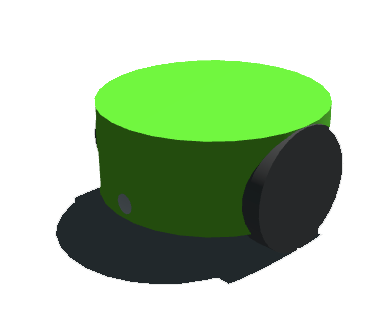

<!-- E-puck image at the very top -->

  

# Evolutionary e-puck Simulator (PyBullet + GA + RL)

## Overview
PyBullet-based simulator for the e-puck mobile robot for evolutionary robotics and learning-based control.
It supports navigation experiments (walls + cylinders), multiple controller encodings, genetic evolution of discrete controllers, and PPO-based RL training with Stable-Baselines3.

Core config file:
- epuck_config.json (most scripts load this by default; use --config to override)

## Quick Start

### Run the viewer (test a controller)
GUI:
python view_epuck_sim.py braitenberg/braitenberg_avoidance.json 5000 true

DIRECT (headless):
python view_epuck_sim.py braitenberg/braitenberg_avoidance.json 5000 false

Custom config:
python view_epuck_sim.py braitenberg/braitenberg_avoidance.json 5000 true --config my_config.json

Keyboard (during sim):
- SPACE: fast mode
- P: pause/resume
- R: reset robot
- H/J: open/close gripper (only if gripper joints are detected)

### Run evolution (genetic algorithm)
python run_epuck_evol.py
python run_epuck_evol.py --config my_config.json

Outputs (typical):
- best_chromosomes/gen_XXXX.json
- best_chromosomes/evolution_YYYYMMDD_HHMMSS.log (logs are ignored by .gitignore)

### Train RL (PPO) and view it in the viewer
Train (exports policy + controller JSON to reinforcement/):
python run_epuck_rl.py

View the trained policy:
python view_epuck_sim.py reinforcement/epuck_rl_controller.json 5000 true

## Controller Encodings (supported by the viewer)
Stable (navigation-focused):
- bitmask
- braitenberg
- behavior_based
- leaky

Experimental / “fine but not core baseline”:
- braitenberg_seek
- rl_policy

Gripper-related (treat as experimental until manipulation is validated):
- braitenberg_gripper

Note:
- The current bitmask sensor grouping is legacy and may not match geometric left/center/right. If you need geometric interpretability, introduce a versioned mapping (e.g., bitmask_v2) rather than silently changing behavior.

## Configuration
All main parameters are centralized in epuck_config.json:
- world: size, walls, gravity, timestep, cylinders, charging station
- robot: urdf_path, wheel_radius, torque, max_speed, friction
- sensors: num_sensors, range, obstacle_threshold
- stuck_detection / unstuck (for testing)
- evolution: GA parameters
- output: verbosity, logging

## Documentation
- docs/RL.md: PPO training + how to run the trained policy in the viewer
- docs/ROADMAP.md: gripper + proprioceptive occlusion + BG action selection roadmap

(Additional docs may be added later: EVOLUTION.md, CONTROLLERS.md, CONFIG.md, TROUBLESHOOTING.md.)

Last Updated: 2026-03-12